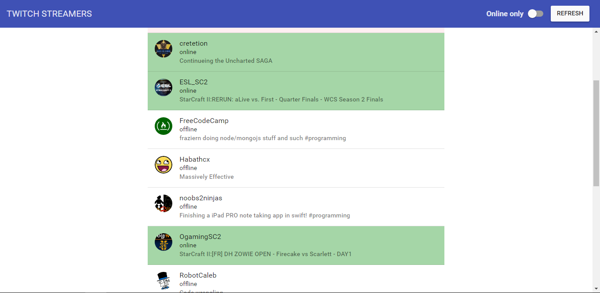
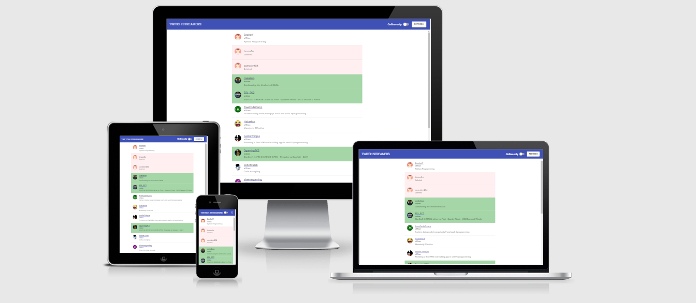

# Twitch API - Streamers 

This application demonstrates Twitch users status using Twitch v3 API.
<br/>
> 
>**Twitch** is the world’s leading social video platform and community for gamers. Each month, more than 100 million community members gather to watch and talk about video games with more than 1.7 million broadcasters.
<br/>


### View streamers status
<br/>

<br/>

### Responsive check
<br/>

<br/>

### Running the App

You can install http-server globally:

```
npm install -g http-serve
```

Then you can start your own development web server to serve static files from a folder by running:

>Move to the `src` folder.</br>
>Run `serve` in a Terminal window</br>
>Open browser to url `http://localhost:3000`

### Resources
* Twitch Website - https://www.twitch.tv
* Twitch API v3 resource - https://github.com/justintv/Twitch-API/tree/master/v3_resources
* Channels - https://github.com/justintv/Twitch-API/blob/master/v3_resources/channels.md
* Streamers - https://github.com/justintv/Twitch-API/blob/master/v3_resources/streams.md
